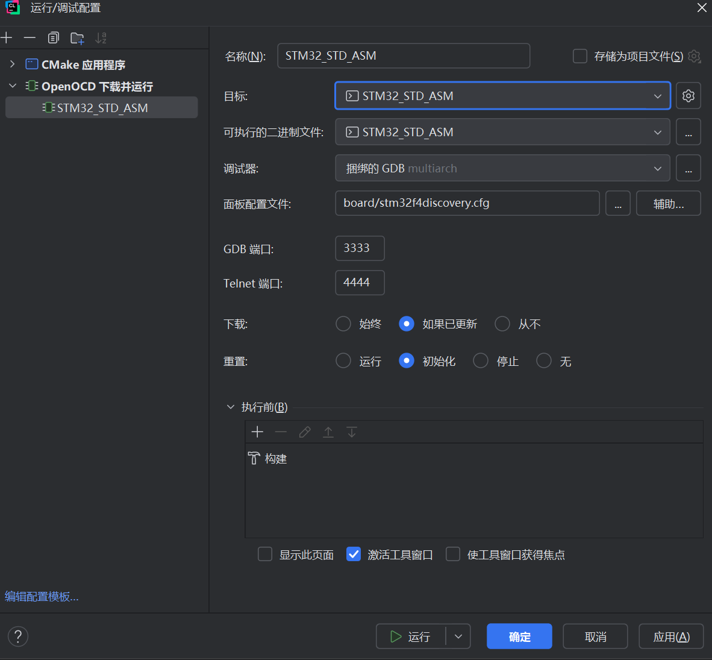
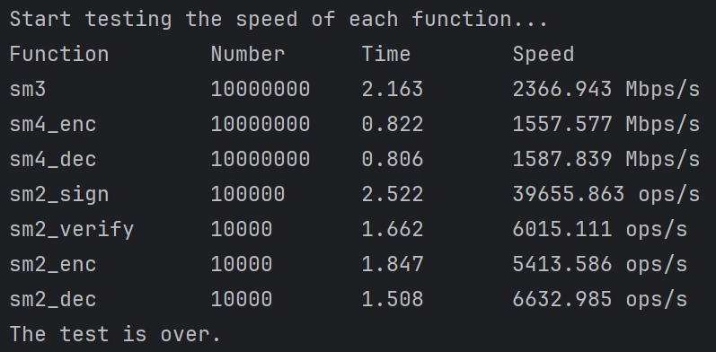
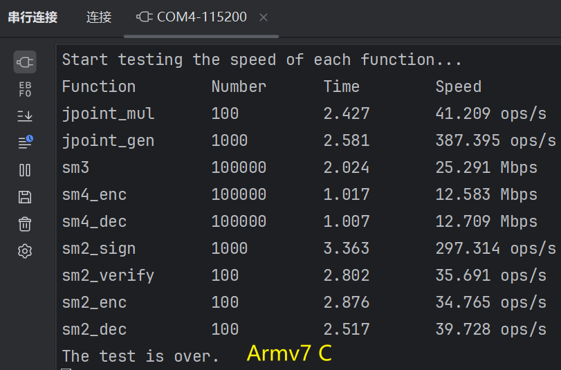
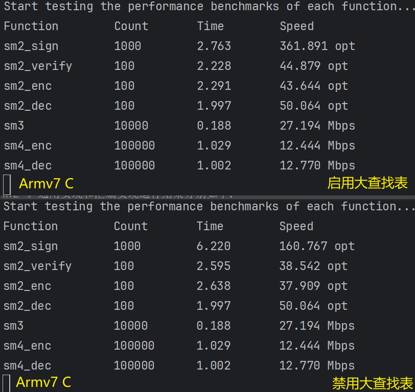
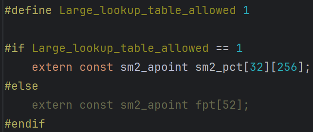

# QCSML

## 1.简介
泉城商密库(QCSML)是由泉城省实验室商用密码技术团队自主开发的国密商用算法开源库，旨在提供基于SM2、SM3和SM4算法的加密、解密、签名、验签和哈希等功能。**当前版本支持x86架构、Armv7架构（已测试stm32f4）。**

## 2.安装使用
### 编译链接
QCSML采用cmake(CMakePresets)构建项目，环境搭建与安装使用如下：
```
cd ~/QCSML
cmake --preset x86-no_asm-release/armv7-no_asm-release/armv7-asm-release
cmake --build --preset x86-no_asm-release/armv7-no_asm-release/armv7-asm-release
```
共三种配置预设，**`x86-no_asm-release`/`armv7-no_asm-release`/`armv7-asm-release`**，分别为**x86平台通用实现、armv7平台通用实现以及armv7平台汇编实现**。编译链接完成后生成如下文件：

- 可执行文件：x86平台位于`build/x86-no_asm/bin/`，armv7平台为`*.elf`
- 二进制及十六进制文件(仅armv7)：`*.bin`及`*.hex`
- 静态库文件：`*.a`
### 部署使用
用户可引用库文件，调用函数进行二次开发。也可以根据设备特性，自主调试源码，生成适合特定需求的应用程序。**使用CLion+OpenOCD可以更便捷的处理项目构建和烧录程序**。

## 3.运行结果
### x86平台
测试环境为`Win11 Intel Core i7-10700 @ 2.90GHz`。运行结果如下：

### armv7平台
测试开发板为`STM32F407VGT6 Cortex-M4 @ 168MHz`。通用实现和汇编实现运行结果分别如下：



## 4.其他
可在`sm2_core.h`中指定是否开启查表


## 5.联系方式
如有任何问题，请随时联系我们 [ts-zhrch@qcl.edu.cn]() or [ts-lixk@qcl.edu.cn]()。